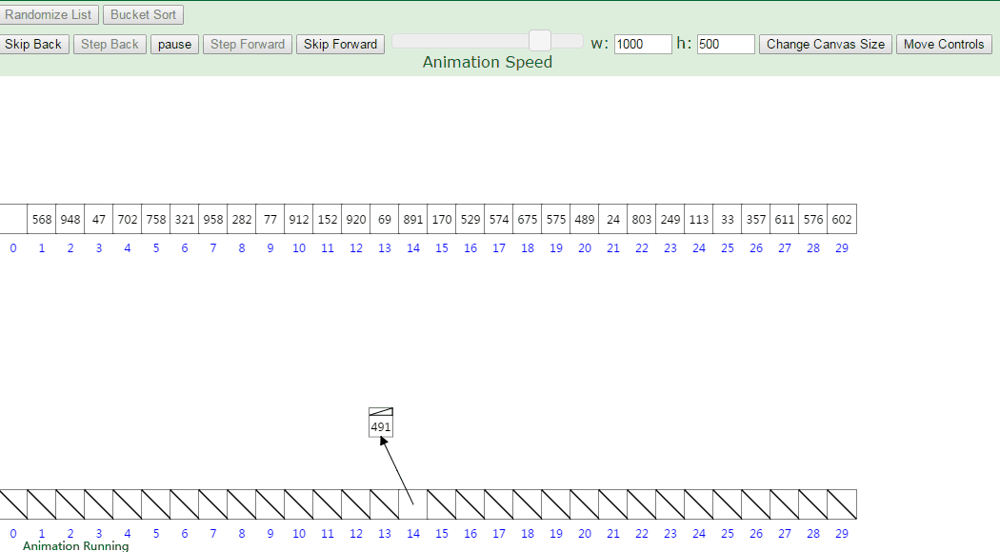

# 桶排序

速度快,但是占内存，实用于排列正整数，不适合浮点数,负数
> 比如排序1-10000以内的数,创建10000一个数组，分别对应1-10000,比如999出现1一次，数组索引999增加一

## 图片示例 (图片来之网络)



## 书本源码（c语言）

```c
#include <stdio.h>

int main () {
    int book[1001], i, j, t, n;
    // 初始化
    for (i = 0; i <= 1000; i++) {
        book[i] = 0
    }
    // 输入一个数n，表示接下来有n个数
    scanf("%d", &n);
    // 循环读入n个数，并进行桶排序
    for (i = 1; i <= n; i++) {
        scanf("%d", &t); // 把每个数读到变量t中
        book[t]++; // 进行计数，对编号为t的桶递增
    }
    // 依次判断编号1000->0的桶
    for (i = 1000; i >= 0; i--) {
        // 出现几次就打印几次
        for (j = 1; j <= book[i]; j++) {
            printf("%d ", i);
        }
    }
    getchar();
    getchar();
    return 0;
}
// 输入
// 10
// 8 100 50 22 15 6 1 1000 999 0

// 输出
// 1000 999 100 50 22 15 8 6 1 0
```

## JavaScript 代码

```javascript
function barrelSort (arr) {
    let max = arr[0]
    // 获取最大数
    arr.forEach(v => {
        if (v > max) {
            max = v
        }
    })
    // 初始化桶
    const barrel = Array(max + 1).fill(0)
    // 把对应的数放到对应的桶中
    for (let i of arr) {
        barrel[i]++
    }
    let result = []
    // 排序
    for(let i = 0; i < barrel.length; i++) {
        for (let j = 0; j < barrel[i]; j++) {
            result.push(i)
        }
    }
    return result
}
var arr = [1,3,4,62,1,5,16,12,435,13,12,54,27,9,99]
console.log(barrelSort(arr))
```