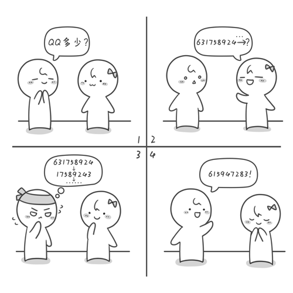

# 解密QQ号---列队

## 书本原文

新学期开始了，小哈是小哼的新同桌（小哈是个小美女哦~），小哼向小哈询问 QQ 号，小哈当然不会直接告诉小哼啦，原因嘛你懂的。所以小哈给了小哼一串加密过的数字，同时小哈也告诉了小哼解密规则。规则是这样的：首先将第 1 个数删除，紧接着将第 2 个数放到这串数的末尾，再将第 3个数删除并将第 4 个数再放到这串数的末尾，再将第 5 个数删除……直到剩下最后一个数，将最后一个数也删除。按照刚才删除的顺序，把这些删除的数连在一起就是小哈的 QQ 啦。现在你来帮帮小哼吧。小哈给小哼加密过的一串数是“6 3 1 75 8 9 2 4”。



OK，现在轮到你动手的时候了。快去找出 9 张便签或小纸片，将“6 3 1 75 8 9 2 4”这 9 个数分别写在 9 张便签上，模拟一下解密过程。如果你没有理解错解密规则的话，解密后小哈的 QQ 号应该是“6 1 5 94 7 2 8 3”。

其实解密的过程就像是将这些数“排队”。每次从最前面拿两个，第 1 个扔掉，第 2 个放到尾部。具体过程是这样的：刚开始这串数是“6 3 1 75 8 9 2 4”，首先删除 6 并将 3 放到这串数的末尾，这串数更新为“1 7 5 89 2 4 3”。接下来删除 1 并将 7 放到末尾，即更新为“5 8 9 24 3 7”。再删除 5 并将 8 放到末尾即“9 2 4 3 7 8”，删除 9 并将 2 放到末尾即“4 3 7 8 2”，删除 4 并将 3 放到末尾即“7 8 2 3”，删除 7 并将 8 放到末尾即“2 3 8”，删除 2 并将 3 放到末尾即“8 3”，删除 8 并将 3 放到末尾即“3”，最后删除 3。因此被删除的顺序是“6 1 5 9 4 7 2 8 3”，这就是小哈的 QQ 号码了，你可以加她试试看^_^。

### 书本源码（c语言）

```c
#include <stido.h>

int main () {
    int q[102] = {0, 6, 3, 1, 7, 5, 8, 9, 2, 4}, head, tail;
    head = 0;
    tail = 10; // 列队有九个元素了，tail指向最后一个位置
    while (head < tail) { // 当列队不为空的时候执行
        // 打印队首并
        printf("%d", q[head]);
        // 将队首出列
        head++;
        // 将新队首防止队尾
        q[tail] = q[head];
        // 队尾递增
        taill++;
        // 队首递减
        head++;
    }
    getchar();
    getchar();
    return 0;
}

// 打印结果为：615947283
```

### JavaScript 代码

```javascript
function decodeQQ (qq = [6, 3, 1, 7, 5, 8, 9, 2, 4]) {
    let head = 0;
    let tail = qq.length;
    const result = []
    while (head !== tail) {
        console.log(qq[head]);
        result.push(qq[head]);
        // 队首出列
        head++;
        qq[tail] = qq[head];
        tail++;
        head++;
    }
    return result
}

console.log(decodeQQ());
/*
    打印结果：
    615947283
*/
```