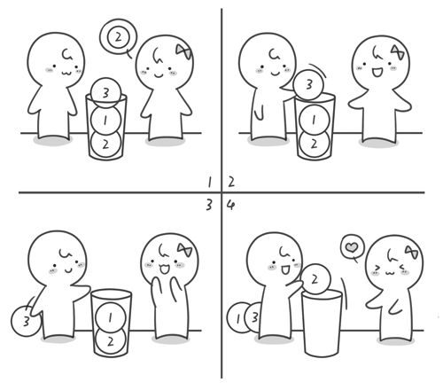

# 解密回文——栈

## 书本摘要（主要部分）

上一节我们学习了列队，它是一种前进先出的数据结构，还有一种数据结构是先进后出，它叫做栈

>比如说有一个小桶，小桶的直径只能放一个小球，我们现在向小桶内依次放入 2 号、1 号、3 号小球。假如你现在需要拿出 2 号小球，那就必须先将 3 号小球拿出，再拿出 1 号小球，最后才能将 2 号小球拿出来。在刚才取小球的过程中，我们最先放进去的小球最后才能拿出来，而最后放进去的小球却可以最先拿出来。这就是后进先出，也可以称为先进后出。



我们生活中还有很多这样的例子，比如我们在吃桶装薯片的时候，要想吃掉最后一片，就必须把前面的全部吃完；再比如我们浏览网页时候需要退回到之前的某个网页，我们需要一步步的点击后退键。还有手-枪的弹夹，在装子弹的时候，最后装的一发子弹，是被第一个打出去的。栈的实现也很简单，只需要一个一维数组和一个指向栈顶的变量 top 就可以了。我们通过变量 top 来对栈进行插入和删除操作。

---

这种特殊的数据结构栈究竟有哪些作用呢？我们来看一个例子。

>“xyzyx”是一个回文字符串，所谓回文字符串就是指正读反读均相同的字符序列，如“席主席”、“记书记”、“aha”和“ahaha”均是回文，但“ahah”不是回文。通过栈这个数据结构我们将很容易判断一个字符串是否为回文。
首先我们需要读取这行字符串，并求出这个字符串的长度。

```c
char a[101]; //101是一个估算值
int len;
gets(a);
len=strlen(a);
```

如果一个字符串是回文的话，那么它必须是中间对称，我们需要求这个字符串的 中点，即：

```c
mid=len/2-1;
```

接下来就轮到栈出场了。

我们先将 mid 之前的部分的字符全部入栈。因为这里的栈是用来存储字符的，所以这里用来实现栈的数组类型是字符数组即 `char s[101];` 初始化栈很简单，top=0;就可以了。入栈的操作是 `top++;s[top]=x;` （假设需要入栈的字符存储暂存在字符变量 x 中）其实可以简写为 `s[++top]=x;`

现在我们就来将 mid 之前的字符依次全部入栈。

```c
    for (int i = 0; i <= mid i ++) {
        s[++i] = a[i]
    }
```

接下来进入判断回文的关键步骤。将当前栈中的字符依次出栈，看看是否能与 mid 之后的字符一一匹配，如果都能匹配则说明这个字符串是回文字符串，否则这个字符串就不是回文字符串。

```c
for (int i = mid + 1; i <= len; i++) {
    if (a[i] != s[top]) {
        break;
    }
    top--;
    if (top == 0)  {
        printf("yes");
    } else {
        printf("no");
    }
}
```

最后如果 top 的值为 0，就说明栈内所有的字符都被一一匹配了，那么这个字符串就是回文字符串。完整的代码如下。

```c
# include <stido.h>
# include <string.h>
int main () {
    char a [101], s[101];
    int i, len, mid, next, top;
    
    gets(a); // 读取一行字符串
    len = strlen(a);
    mind = len / 2 - 1;

    top = 0 // 栈的初始化;
    // 将mid 依次入栈
    for (int i = 0; i < mid; i++) {
        s[++top] = a[i];
    }

    // 判断字符串长度是奇数还是偶数，并找出需要进行字符串匹配的起始下标
    if (len % 2 === 0) {
        next = mid + 1;
    } else {
        next = mid + 2;
    }

    for (i = next; i <= len - 1; i ++) {
        if (a[i] !== s[top]) {
            break;
        }
        top--;
    }

    // 入伙top 等于0 的话，说明所有的字符串都被匹配了
    if (top == 0) {
        printf("yes");
    } else {
        printf("no");
    }
    return 0;
}
```

### JavaScript 代码

```javascript

function strBack (str = '123321') {
    const {length} = str
    // 判断个数为奇数
    const isOdd = length % 2 === 1
    let mid, i = 0, stack = [];
    if (!isOdd) {
        mid = length / 2 - 1
    } else {
        mid = (length + 1) / 2 -1
    }
    // 将前半部分入栈
    for (i = 0 ; i <= mid; i++) {
        stack.unshift(str[i])
    }
    for (i = 0; i <= mid; i++) {
        if (stack[i] !== str[mid + (isOdd ? 1 : 0)  + i]) {
            return false
        }
    }
    return true
}
strBack()

```