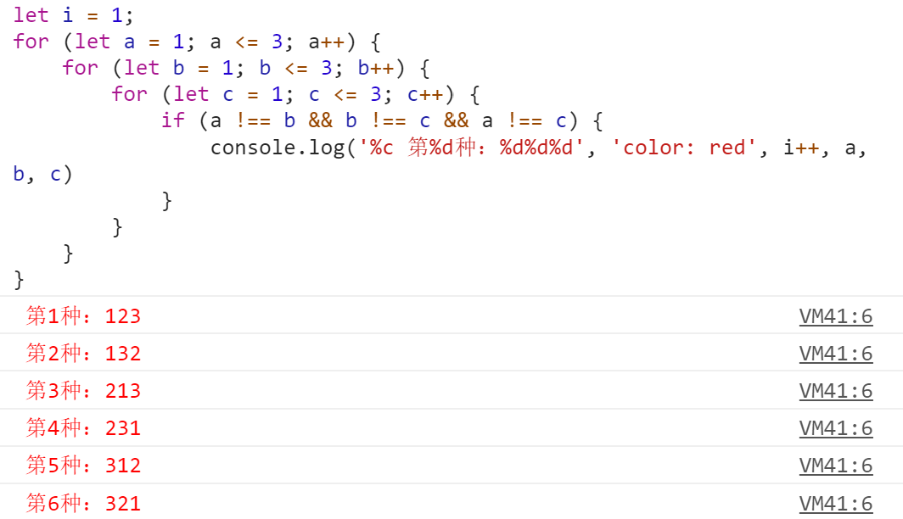

# 数的全排列

刚刚研究完火柴棍，小哼又在研究一种特殊的排列——全排列

> 123的全排列 123，132，213，231，312，321。1234的全排列有1234，1243，1324，1342，2134，2143，2314，2341，2413，2431，3124，3214，3241，3412，3421，4123，4132，4213，4231，4312，4321。小哼现在需要写出12345678的全排列。

实现123的全排列

```javascript

let i = 1;
for (let a = 1; a <= 3; a++) {
    for (let b = 1; b <= 3; b++) {
        for (let c = 1; c <= 3; c++) {
            if (a !== b && b !== c && a !== c) {
                console.log('%c 第%d种：%d%d%d', 'color: red', i++, a, b, c)
            }
        }
    }
}

```

==代码运行结果==



1234的全排列代码类似，这里就不写了，123 和 1234 的全排列尚且简单，现在终极问题来了，输入指定的一个数n，输出1~n的全排列，又该如何？例如：输入3时的输出123全排列，输入5的时候输出12345的全排列。

有没有方便一点的办法了？请看下一章节——万能的搜索。
