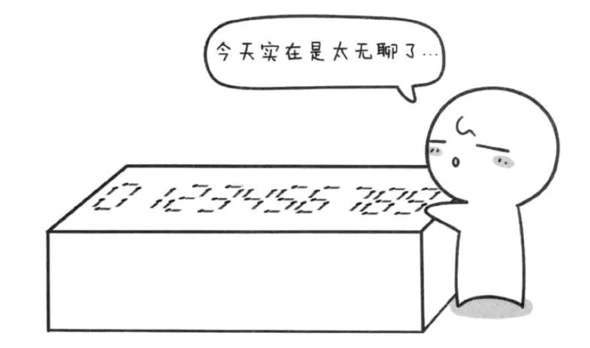

# 火柴棍等式

闲来的小哼，又拿出了火柴棍，不知道在摆弄什么。。。



> 1，加号和等号都需要两个火柴棍。
> 2，A不等于B，则A+B=C与B+A=C视为不等式（A，B，C都大于0）
> 3，所有的火火柴棍都全部的用上

既然要找出这样的A+B=C的等式，最简单的办法就是枚举A、B、C。A，B，C的枚举范围就是0~1111之间就可以了，为什么了==因为最多24根火柴棍即`m <= 24`除去“+”和“=”号的4根就剩下20根了。而0~9之间用到火柴棍最少的就是1，所以20根火柴棍最多组成10个1，因此A+B=C这个等式中的A，B，C都不能超过1111

## 实现代码

```javascript
function match (x) {
    /*
        num用来计数的变量
        f 表示0~9所需要用到多少根火柴
    */
    let num = 0, f = [6, 2, 5, 5, 4, 5, 6, 3, 7, 6]
    while ((x / 10 | 0) != 0) {
        num += f[x % 10]
        x = (x / 10) | 0
    }
    num += f[x]
    return num
}
void function (m) {
    let a, b, c, sum = 0; // sum 用来计算，因此一定要初始化
    for(a = 0; a <= 1111; a++) {
        for(b = 0; b <= 1111; b++) {
            c = a + b
            if(match(a) + match(b) + match(c) == m - 4) {
                console.log('%d + %d = %d', a, b, c)
                sum++
            }
        }
    }
} (18)
// 输出结果
/*
    0 + 4 = 4
    0 + 11 = 11
    1 + 10 = 11
    2 + 2 = 4
    2 + 7 = 9
    4 + 0 = 4
    7 + 2 = 9
    10 + 1 = 11
    11 + 0 = 11
*/
```