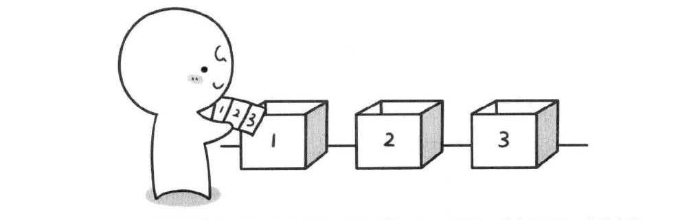

# 第4章 第一节 

## 不撞南墙的回头——深度优先遍历

在上一章留下了一个问题：输入n输出1~n的全排列。这里我们先将这个问题形象化，举个例子。假如有编号1，2，3的3张扑克和编号1，2，3的3个盒子，现在需要3张扑克牌分别盒子里面，并且每个盒子有且只能放一张扑克牌。那么一共有多少种放法？



我们现在来解决最基本的问题：如何往小盒子中放扑克牌。每一个小盒子都能放1，2，3号扑克牌，这需要一一去尝试，这里一个for循环就可以解决

```javascript
for (let i = 1; i <= n; i++) {
    a[step] = i // 将i号扑克牌放置step个盒子中
}
```

这里a是表示小盒子的，变量step表示当前正处于第step个小盒子面前。`a[step]=i`就是将第i号扑克放置第step个盒子中。这里有一个问题，如果一个扑克牌已经放到别的盒子中了，那么此时就不能再放入同样的扑克牌到当前的小盒子中了，因为手中已经没有这张牌了，因此还需要一个数组book来标记那些牌已经使用了。

```javascript
for (let i = 1; i <= n; i++) {
    if (book[i] === 0) {
        a[step] = i; // 将i号扑克放入第step个盒子中
        book[i] = 1 // book[i] = 1 表示i号扑克已经不在手中了
    }
}
```

我们将该函数分装成一个函数`dfs`来实现处理第step个小盒子

```javascript
function dfs (step = 1) {
    for (let i = 1; i <= n; i++) {
        if (book[i] === 0) {
            a[step] = i; // 将i号扑克放入第step个盒子中
            book[i] = 1 // book[i] = 1 表示i号扑克已经不在手中了

            dfs(setp++); // 这里通过递归来实现
            book[i] = 0 // 这一步非常重要，一定要将刚才尝试的扑克牌收回，才能进行下一次尝试
        }
    }
    return
}

```

上面的代码中的`book[i] = 0`这条语句非常重要，这句话的作用是将小盒子中的扑克牌收回，因此在一次摆放尝试结束返回的时候，如果不讲小盒子中的牌收回，将无法进行下一次摆放。还生一个问题，就是什么时候可以输出一个满足需求的序列。其实当我们进行处理到`n+1`个小盒子的时候，那么说明前n个盒子都已经放好扑克牌了，这里就将1~n个小盒子扑克牌编号打印出来了。

### 完整代码

```javascript

function dfs (n) {
    let a = Array(10).fill(0),  book = Array(10).fill(0);
    function for_dfs(step = 1) {
        if (step === (n + 1)) {
            console.log(a.slice(1, n + 1).join(''))
            return
        }

        for (let i = 1; i <= n; i++) {
            if (book[i] === 0) {
                a[step] = i
                book[i] = 1
                for_dfs(step + 1);
                book[i] = 0
            }
        }
    }
    for_dfs(1)
    return
}

dfs(3)
/*
    123
    132
    213
    231
    312
    321
*/
```

现在你应该可以用新学的算法重新解决第3章的第一节\_ \_ \_ + \_ \_ \_ = \_ \_ \_的问题了

其实就是判断 `a[1] * 100 + a[2] * 10 + a[3] + a[4] * 100 + a[5] * 10 + a[6] = a[7] * 100 + a[8] * 10 + a[9]` 是否成立

```javascript

function dfs () {
    let a = Array(10).fill(0),  book = Array(10).fill(0), total = 0;
    function for_dfs(step = 1) {
        if (step === 10) {
            if (a[1] * 100 + a[2] * 10 + a[3] + a[4] * 100 + a[5] * 10 + a[6] === a[7] * 100 + a[8] * 10 + a[9]) {
                console.log(a.slice(1).join(''))
                total++
                return
            }
        }
        for (let i = 1; i <= 9; i++) {
            if (book[i] === 0) {
                a[step] = i
                book[i] = 1
                for_dfs(step + 1);
                book[i] = 0
            }
        }
    }
    for_dfs(1)
    return
}

dfs()
```