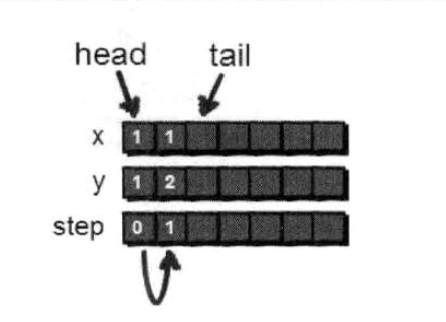
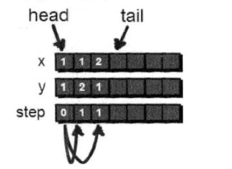
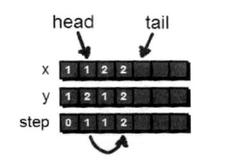
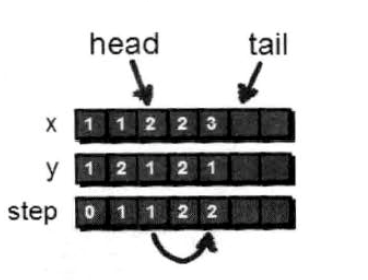

# 层层递进——广度优先搜索

在上面解决小哈的行动上。我们使用了深度优先搜索的方法。这里我们介绍另一种方法解决问题——广度优先搜索（BFS）

我们还是用一个二位数组来存储这里迷宫，上一章节我们利用深度优先，递归的方法实现。现在介绍另一种方法“一层一层”扩展的方法来解救小哈。扩展时每发现一个点就将这个点加入列队中，直到找到小哈。具体如下。

最开始在入口（1，1）处，一部之内可以走到（2，1）和（1，2）这两个点。


但是小哈不在这个点上，那小哼只能通过（1，2）和（2，1）这两个点继续往下走，比如我们现在走到（2，1）这个点，之后他又能到达那个点呢？有（2，2），再看看通过（2，1）还可以到达（3，1），此时你会发现（2，2）这个点你可以通过（1，2）（2，1）都可都可以到达，并且都使用了2步，为了防止多次被走到，这里需要一个数组来记录一个点是都被走过。


反复重复上面的步骤直到找到小哈为止


回顾一下刚才的算法，可以通过一个列队来模拟这个过程

```javascript

const que = Array(2051) // 因为地图大小不能超过50*50 因此扩展列队不能超过2500个
let head = 1, tail = 1;
// 用来存储地图
const a = Array(51).fill(0).map(v => Array(51).fill(0).map(v => 0))
// 用来标记那些点在列队中了
const book = Array(51).fill(0).map(v => Array(51).fill(0).map(v => 0))

// 第一步将起始点（1，1）加入列队，并标记已走过了
que[tail] = {
    x: 1,
    y: 1,
    s: 0
}
tail++
book[1][1] = 1
```


然后（1，1）开始，往后尝试（1，2）

```javascript
tx = que[head].x
ty = que[head].y + 1
```

判断（1，2）是否越界

```javascript
if (tx < 1 || tx > n || ty < 1 || ty > m)
```

再判断（1，2）是否为障碍物或者已经在路径中

```javascript
if (a[tx][ty] === 0 && book[tx][ty] === 0) {
    // dothing
}
```

如果满足上面要求，则将（1，2）纳入列队，并标记该点已走过

```javascript
// 把这个点标记已经走过
book[tx][ty] = 1
// 出入新的列队
que[tail].x = tx
que[tail].y = ty
que[tail].s = que[head].s + 1
tail++
```



接下来还要继续尝试往其他方向走。这里还有规定一个顺序（按照下右上左的方向来）。我们发现（1，1）还是可以到达（2，1），因此也需要加入列队。代码实现与刚才的（1，2）操作一样的。



对（1，1）这个点扩展完毕后，其实（1，1）这个点已经没有什么用了，此时我们将（1，1）出队，操作很简单`head++`

接下来我们继续对（1，2）和（2，1）这两个点继续探索。到目前为止，我们扩展出（1，1）一部以内的所有点。因为还没有到达小哈的位置。所以还要继续探索。

（1，1）出队后，现在队列head正好指向（1，2）这个点，现在我们需要通过这个点继续扩展，通过（1，2）到达（2，2）这个点，并将（2，2）这个点加入列队。



（1，2）这个点已经处理完毕，对我们来说已经没用了，于是将他出队。（1，2）出队后head指向（2，1）这个点，通过（2，1）这个点我们可以扩展到（3，1）和（2，2），但是（2，2）已经在列队之中了，因此我们只需要将（3，1）加入列队



我们继续探索

为了方便探索，与上节一样我们定义一个next数组

```javascript
const next = [
    [0, 1],
    [1, 0],
    [0, -1],
    [-1, 0]
]
```

## 完整代码如下

```javascript
viod function () {
    const que = Array(2501).fill(0).map(v => {}) // 因为地图大小不能超过50*50 因此扩展列队不能超过2500个
    console.log(que)
    let head = 1, tail = 1;
    let i, j, k, n = 5, m = 4, start_x = 1, start_y = 1, p = 4, q = 3, tx, ty, flag;
    // 用来存储地图
    const a = Array(51).fill(0).map(v => Array(51).fill(0).map(v => 0))
    // 初始化地图
    a[1][3] = 1
    a[3][3] = 1
    a[4][2] = 1
    a[5][4] = 1
    // 用来标记那些点在列队中了
    const book = Array(51).fill(0).map(v => Array(51).fill(0).map(v => 0))
    // 定义用于表达方向的数组
    const next = [
        [0, 1],
        [1, 0],
        [0, -1],
        [-1, 0]
    ]
    // 插入迷宫入口
    que[tail].x = start_x
    que[tail].y = start_y
    que[tail].s = 0
    que[tail].f = 1
    tail++
    book[start_x][start_y] = 1

    flag = 0; // 用来标记是否到达目的地 0 表示没有，1表示到达
    // 当列队不为空的时候循环
    while (head < tail) {
        for (k = 0; k < 3; k++) {
            tx = que[head].x
            ty = que[head].y + 1
            if (tx < 1 || tx > n || ty < 1 || ty > m) {
                continue
            }
            if (a[tx][ty] === 0 && book[tx][ty] === 0) {
                // 把这个点标记已经走过
                book[tx][ty] = 1
                // 出入新的列队
                que[tail].x = tx
                que[tail].y = ty
                que[tail].f = head // 因为这点点是head扩展出来的，所以f为府父元素
                que[tail].s = que[head].s + 1
                tail++
            }

            // 如果已经到达目标点，停止扩展，退出循环
            if (tx == p && ty == q) {
                flag = 1
                break;
            }
        }
        if (flag === 1) {
            break
        }
        head++
    }
    return que[tail - 1].s
} ()
```