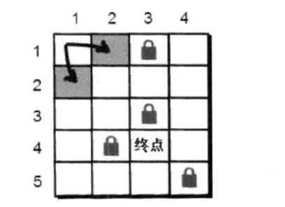
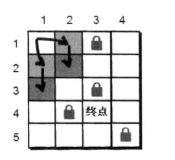
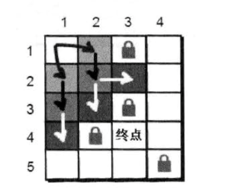
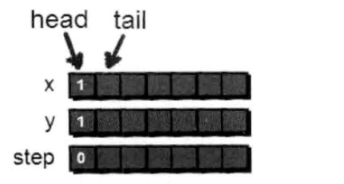

# 层层递进——广度优先搜索

在上面解决小哈的行动上。我们使用了深度优先搜索的方法。这里我们介绍另一种方法解决问题——广度优先搜索（BFS）

我们还是用一个二位数组来存储这里迷宫，上一章节我们利用深度优先，递归的方法实现。现在介绍另一种方法“一层一层”扩展的方法来解救小哈。扩展时每发现一个点就将这个点加入列队中，直到找到小哈。具体如下。

最开始在入口（1，1）处，一部之内可以走到（2，1）和（1，2）这两个点。



但是小哈不在这个点上，那小哼只能通过（1，2）和（2，1）这两个点继续往下走，比如我们现在走到（2，1）这个点，之后他又能到达那个点呢？有（2，2），再看看通过（2，1）还可以到达（3，1），此时你会发现（2，2）这个点你可以通过（1，2）（2，1）都可都可以到达，并且都使用了2步，为了防止多次被走到，这里需要一个数组来记录一个点是都被走过。



反复重复上面的步骤直到找到小哈为止



回顾一下刚才的算法，可以通过一个列队来模拟这个过程

```javascript

const que = Array(2051) // 因为地图大小不能超过50*50 因此扩展列队不能超过2500个
let head = 1, tail = 1;
// 用来存储地图
const a = Array(51).fill(0).map(v => Array(51).fill(0).map(v => 0))
// 用来标记那些点在列队中了
const book = Array(51).fill(0).map(v => Array(51).fill(0).map(v => 0))

// 第一步将起始点（1，1）加入列队，并标记已走过了
que[tail] = {
    x: 1,
    y: 1,
    s: 0
}
tail++
book[1][1] = 1
```



然后（1，1）开始，往后尝试（1，2）

```javascript
tx = que[head].x
ty = que[head].y + 1
```

判断（1，2）是否越界

```javascript
if (tx < 1 || tx > n || ty < 1 || ty > m)
```

再判断（1，2）是否为障碍物或者已经在路径中

```javascript
if (a[tx][ty] === 0 && book[tx][ty] === 0) {
    // dothing
}
```

如果满足上面要求，则将（1，2）纳入列队，并标记该点已走过

```javascript
// 把这个点标记已经走过
book[tx][ty] = 1
// 出入新的列队
que[tail].x = tx
que[tail].y = ty
que[tail].s = que[head].s + 1
tail++
```