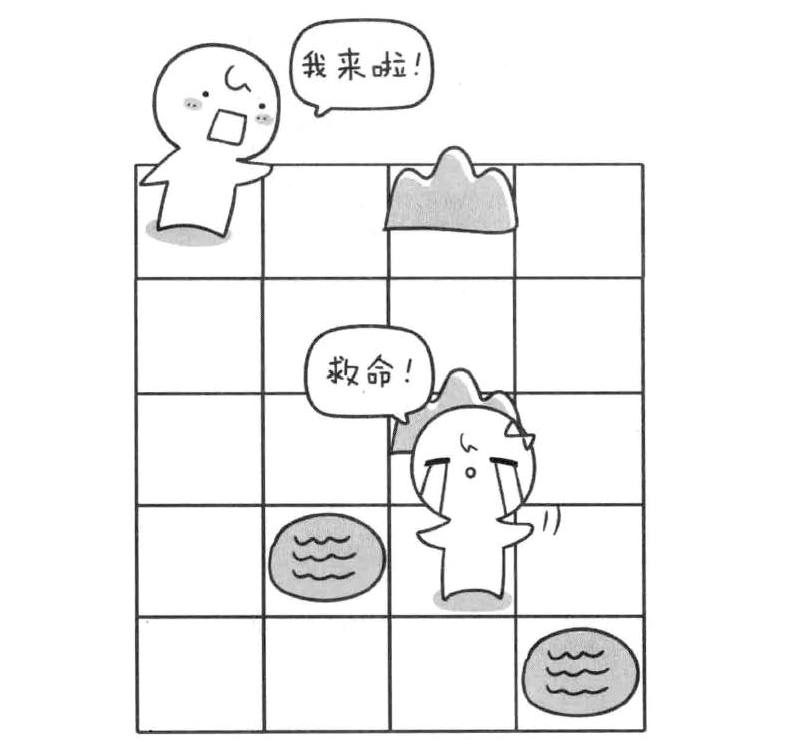
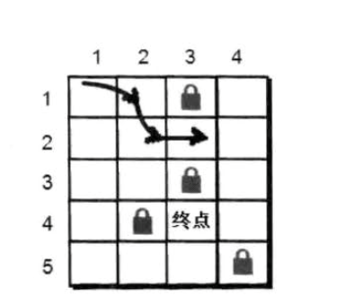
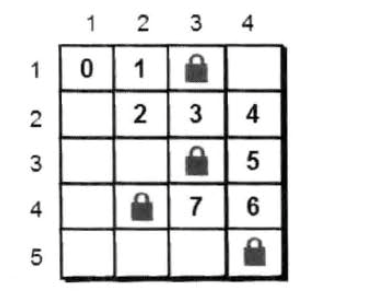

# 解救小哈

有一天，小哈一个人去迷宫。但是方向感不好的小哈很快就迷路了，小哼得知后便立即去解救小哈。当然小哈是有备而来，已经弄清楚了地图，现在小哼要以最快的速度去解救小哈，问题就此开始了。。。

> 迷宫是n行m列单元格组成的(n和m都小于等于50)，每个单元格要么是空的要么是障碍物。你的任务就是帮助小哼找到一条起点最快的路



首先我们将这个迷宫通过一个二维数组表示，小哼处于迷宫的入口处（1，1），小哈则在（p,q）处，小哼只有一个一个的去尝试，我们可以先让小哼往右边走，直到走不通的时候再回到这里，再去尝试另外的一个方向，如下图



我们先看看小哼一步之内可以到达的点有哪些（1，2）和（2，1）根据刚才的策略我们先往右边走，小哼来到了（2，1）这个点，来到了（2，1）这个点之后又能到达那个点呢，只有（2，2）因为（1，3）是障碍物，（1，1）是刚才已经走过的点了所以也不能走。所以小哼还得继续往下走，直到找到小哈



现在我们通过深度优先搜索来实现这个方法，先来看`dfs 函数`的功能是解决当前问题应该怎么办。而小哼处在某个点的时候需要处理的是：*先检查小哼是都已经到达小哈的位置*，如果没有到达则找出下一步怎么走的地方

```javascript
function dfs (x, y, step) {
    if (x === p && y === q) {
        if (step < min) { // 更新最小值
            min = step
        }
        return
    } 
    return
}
```

如果没有找到小哈，则找出下一步可以走的地方。因为有四个方向可以走，根据之前的约定，我们按照顺时针的方向来尝试，为了变成方便我们定义一个方位数组

```javascript
const next = [
    [0, 1],
    [1, 0],
    [0, -1],
    [-1, 0],
]
```

通过这个数组，我们很容易用循环就实现了下一步的坐标。这里将下一步的坐标用tx，ty来存储。

```javascript
for (let i = 0; i <= 3; i++) {
    // 计算的下一个点坐标
    tx = next[i][0]
    ty = next[i][1]
}
```

接下来我们就对下一个点（tx，ty）判断是否越界和碰到障碍物以及这个点是否已经在路径中（避免重复访问一个点），需要用`book[tx][ty]`来记录格子是否已经存在路径中

```javascript
for (let k = 0; k <= 3; k++) {
    tx = x + next[k][0]
    ty = y + next[k][0]
    // 判断是否越界
    if (tx < 1 || tx > n || ty < 1 || ty > m) {
        continue;
    }
    // 判断该是否为障碍物或者已经在路上
    if (a[tx][ty] === 0 && book[tx][ty] === 0) {
        book[tx][ty] = 1 // 标记这个点已经走过了
        dfs(tx, ty, step)
        book[tx][ty] = 0 // 尝试结束这个点的标记
    }
}
```

## 完成代码

```javascript
void function dfs () {
    // 申明一些全局常量和变量
    const next = [
        [0, 1],
        [1, 0],
        [0, -1],
        [-1, 0],
    ]
    let n = 5, m = 4, p = 4, q = 3, min = 999999
    let start_x = 1, start_y = 1;
    const a = [
        [0, 0, 0, 0, 0],
        [0, 0, 0, 1, 0],
        [0, 0, 0, 0, 0],
        [0, 0, 0, 1, 0],
        [0, 0, 1, 0, 0],
        [0, 0, 0, 0, 1]
    ]
    const book = [
        [0, 0, 0, 0, 0],
        [0, 0, 0, 0, 0],
        [0, 0, 0, 0, 0],
        [0, 0, 0, 0, 0],
        [0, 0, 0, 0, 0],
        [0, 0, 0, 0, 0]
    ]
    function for_dfs (x, y, step) {
        let tx, ty, k
        if (x === p && y === q) {
            console.log('找到了')
            if (step < min) {
                min = step
            }
            return
        }
        // 枚举4种走法
        for (let k = 0; k <= 3; k++) {
            tx = x + next[k][0]
            ty = y + next[k][1]
            // 判断是否越界
            if (tx < 1 || tx > n || ty < 1 || ty > m) {
                continue;
            }
            // 判断该是否为障碍物或者已经在路上
            if (a[tx][ty] === 0 && book[tx][ty] === 0) {
                book[tx][ty] = 1 // 标记这个点已经走过了
                for_dfs(tx, ty, step + 1)
                book[tx][ty] = 0 // 尝试结束这个点的标记
            }
        }
        return
    }
    for_dfs(start_x, start_y, 0)
    console.log(min)
} ()

```