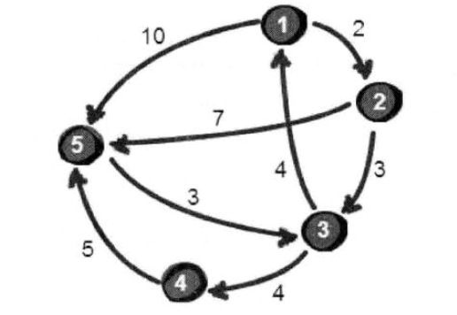
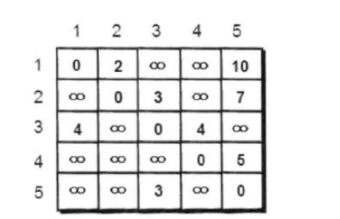

# 城市地图——图的深度优先遍历

暑假小哼想到小哈家里去玩，小哼住在A城市，小哈住在B城市，小哼用百度地图导航去小哈家，百度地图很快就计算出了小哼到小哈家的最短路程，爱思考的我想直到百度地图是如何计算的。


我们抽象出这样一副地图



这里有5个城市（点表示）和8条公路（线表示）

    1号城市 ——> 5号城市 路程 10公里
    1号城市 ——> 2号城市 路程 2公里
    2号城市 ——> 3号城市 路程 3公里
    2号城市 ——> 5号城市 路程 7公里
    3号城市 ——> 1号城市 路程 4公里
    3号城市 ——> 4号城市 路程 4公里
    4号城市 ——> 5号城市 路程 5公里
    5号城市 ——> 3号城市 路程 3公里

已知有5个城市和8条公里，我们可以用5*5的二维数组来表示这些数



## 完整代码

```javascript

void function dfs () {
    let min = 9999, n = 6;
    const book = Array(n).fill(0).map(v => Array(n).fill(0).map(v => 0));
    const e = [ // 地图数据 -1表示为无穷大
        0, 0, 0, 0, 0, 0,
        0, 0, 2, -1, -1, 10,
        0, -1, 0, 3, -1, 7,
        0, 4, -1, 0, 4, -1,
        0, -1, -1, -1, 0, 5,
        0, -1, -1, 3, -1, 0
    ]
    function for_dfs(cur, dis) {
        // 如果路程已经大于最小路程就不用往下尝试了
        if (dis > min) {
            return
        }
        // 如果当前城市已经到达目的城市
        if (cur === n) {
            // 更新最小路程
            if (dis < min) {
                min = dis
            }
            return
        }
        for (let i = 1; i <= n; i++) {
            if (e[cur][i] !== -1 && book[i] === 0) {
                book[i] = 1;
                for_dfs(i, dis + e[cur][i])
                book[i] = 0
            }
        }
    }
    for_dfs(1, 0)
    console.log(min)
} ()

```