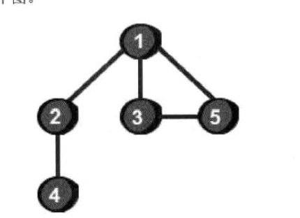
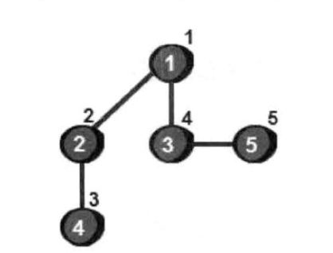
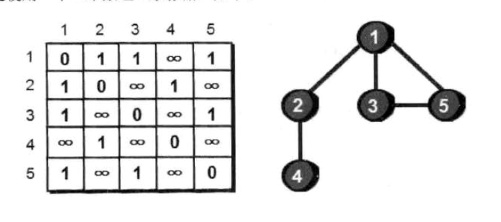
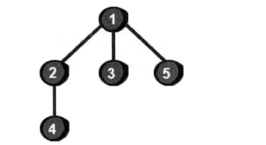
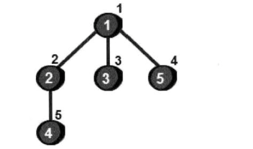
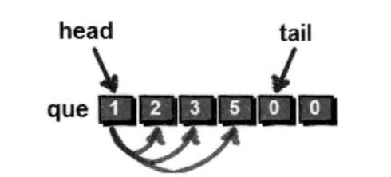

# 深度和广度优先遍历是指啥

前面我们已经学习了深度和广度搜索，为什么叫做深度和广度呢？其实是针对图的遍历而言请看下图

## 深度优先遍历搜索



> 图就是由一些小圆点（称为顶点）的和链接这些小圆点的直线（称为边）组成的。例如上图是由5个顶点（编号1，2，3，4，5）和5条边（1-2，1-3，1-5，3-5，2-4）组成

现在我们从1号点开始遍历这个图，遍历就是指把每个点都访问一遍。使用深度优先搜索遍历得道这样的结果。



> 深度优先遍历的主要思想就是：==首先以一个未被访问过的顶点作为起始顶点，沿着当前顶点的边走到未被访问过的顶点；当没有未访问过的顶点时，则回到上一个顶点，继续试探访问别的顶点，直到所有的顶点都被访问完==



上图二位数组表示第i行第j列表示的就是顶点i到顶点j是否有边，1表示有，∞表示没有，这里我们将自己到自己（即i等于j）设置为0，我们将存储图的方法称为图的邻接矩阵存储法。

## 深度优先搜索遍历代码

```javascript
void function dfs (n = 5) {
    // cur 表示当前所在的顶点编号
    let book = Array(n + 1).fill(0), sum = 0, e = Array(n + 1).fill(0).map(v => Array(n + 1)).fill(0).map(v => []);
    // 初始化二位矩阵
    for (let i = 1; i <= n; i++) {
        for (let j = 1; j <= n; j++) {
            if (i === j) {
                e[i][j] = 0
            } else {
                e[i][j] = 99999 // 表示无穷大
            }
        }
    }

    // 初始化边
    e[1][2] = 1
    e[1][3] = 1
    e[1][5] = 1
    e[2][1] = 1
    e[2][4] = 1
    e[3][1] = 1
    e[3][5] = 1
    e[4][2] = 1
    e[5][1] = 1
    e[5][3] = 1
    // 从1号开始出发
    book[1] = 1
    function for_dfs(cur) {
       let i
       console.log('当前位于 => %d 节点', cur)
       sum++
       if (sum == n) {
           return // 所有节点都访问完了
       }
       for (i = 1; i <= n; i++) {
           if (e[cur][i] === 1 && book[i] === 0) {
               book[i] = 1
               for_dfs(i)
           }
       }
       return
   }
   // 默认从1出发
   for_dfs(1)
} ()
```

## 广度优先遍历搜索

广度优先搜索来遍历如下



这5个节点访问顺序如下图



使用广度优先遍历来遍历这个图如下，首先以一个未被访问的顶点作为起始点作为顶点，比如1号顶点为起始顶点，将1号放入列队，然后将与1号相关的依次放入列队。如下图



接下来在将2号相关的顶点放入列队。


> 广度优先遍历主要思想： ==首先以一个未被访问的顶点作为起始顶点，访问所有相邻的顶点，然后再依次对相邻的顶点访问他们相邻的顶点==

### 广度优先遍历代码

```javascript
void function bfs () {
    let i = 0, j = 0, n = 5, m = 5, cur = 0;
    let book = Array(n + 1).fill(0), e = Array(n + 1).fill(0).map(v => Array(n + 1)).fill(0).map(v => 0);
    let que = Array(100).fill(0)
    // 初始化二位矩阵
    for (let i = 1; i <= n; i++) {
        for (let j = 1; j <= n; j++) {
            if (i === j) {
                e[i][j] = 0
            } else {
                e[i][j] = 99999 // 表示无穷大
            }
        }
    }

    // 初始化边
    e[1][2] = 1
    e[1][3] = 1
    e[1][5] = 1
    e[2][1] = 1
    e[2][4] = 1
    e[3][1] = 1
    e[3][5] = 1
    e[4][2] = 1
    e[5][1] = 1
    e[5][3] = 1

    // 列队初始化
    head = 1
    tail = 1

    // 从一号顶点出发，将一号纳入列队
    que[tail] = 1
    tail++
    book[1] = 1 // 标记1号顶点已访问

    while(head < tail && tail <= n) {
        cur = que[head]
        for (i = 1; i <= n; i++) {
            if (e[cur][i] === 1 && book[i] === 0) {
                que[tail] = i
                tail++
                book[i] = 1
            }
            if (tail > n) {
                break
            }
        }
        head++ // 注意这个地方，千万不要忘记当一个顶点扩展结束后，head++，然后才能继续往下扩展
    }
    for (i = 1; i < tail; i++) {
        console.log(que[i])
    }
} ()
```