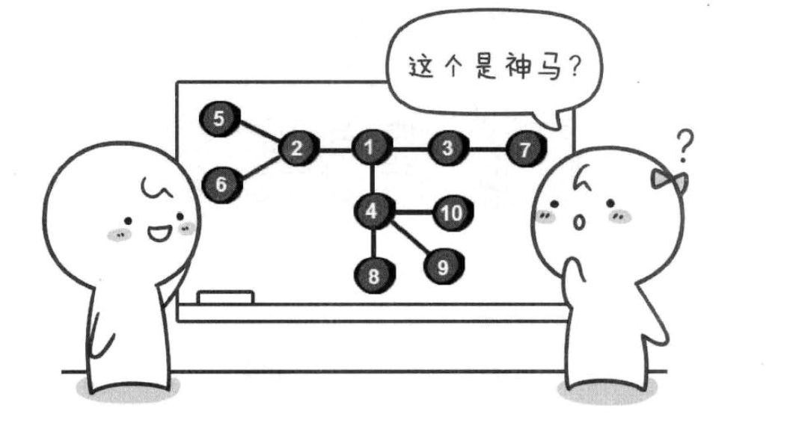
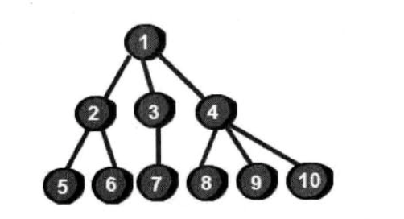
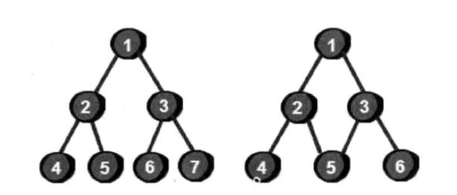
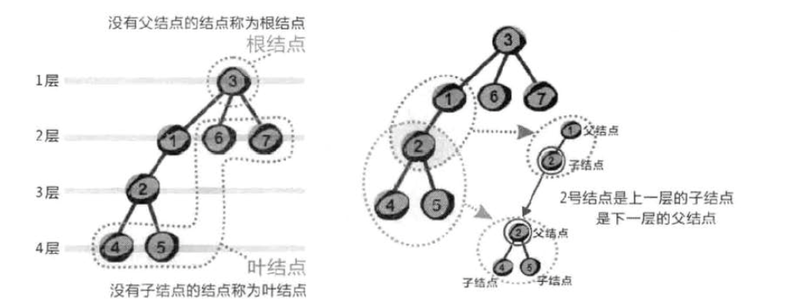

# 开启”树“之旅

我们来来一个例子

这是什么？一个图？不对，这是一个树

你可能会问，树和图有什么区别？==树就是不包含回路的连通无向图==

上面这个例子左边是一棵树，右边是一个图，因为左边没有回路，右边存在回路1——>2——>5——>2——>1 这样的回路

树的特点

* 一棵树中的任意两个节点有且仅有一条路径相同
* 一棵树如果有n个节点，那么它一定恰好有n-1条边
* 在一个数中加一条边将构成回路形成一个图

树的介绍

